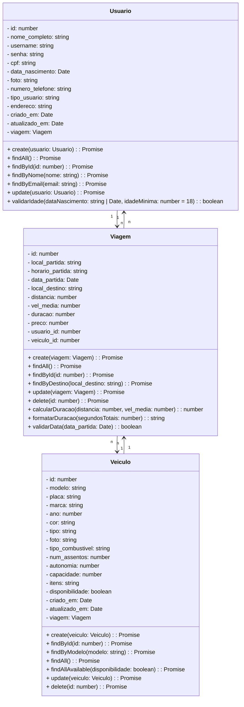

# Projeto BoraAí - Backend

<br />
<div align="center">
    
</div>
<br /><br />

## 1. Descrição

O BoraAí é uma plataforma de caronas compartilhadas que conecta motoristas e passageiros que possuem trajetos em comum. Com foco na praticidade, economia e sustentabilidade, a aplicação permite criar e gerenciar viagens, promovendo a redução de custos e o impacto ambiental positivo.

---

## 2. Sobre esta API

Esta API foi construída para ser o backend do sistema BoraAí, centralizando o gerenciamento de usuários, veículos e viagens. Sua arquitetura segue os princípios de modularidade, escalabilidade e boas práticas de desenvolvimento, garantindo alta performance e facilidade de manutenção.

### 2.1. Principais Funcionalidades

1. Cadastro e gerenciamento de usuários.

2. Cadastro e gerenciamento de veículos.

3. Criação, consulta e gerenciamento de viagens.

4. Relacionamentos eficientes entre entidades (usuários, veículos e viagens).

5. Banco de dados relacional com suporte a consultas e transações complexas.

---

## 3. Diagrama de Classes



---

## 4. Diagrama Entidade-Relacionamento (DER)

Adicione a imagem do Diagrama:

<div align="center">
    
</div>

---

## 5. Tecnologias Utilizadas

| Item                          | Descrição  |
| ----------------------------- | ---------- |
| **Servidor**                  | Node.js    |
| **Linguagem de Programação**  | TypeScript |
| **Framework**                 | NestJS     |
| **ORM**                       | TypeORM    |
| **Banco de Dados Relacional** | MySQL      |

---

## 6. Configuração e Execução

1. Clone o repositório:

   ```bash

   git clone [https://github.com/seu-repositorio/boraaí-backend.git](https://github.com/Projeto-Integrador-G4-JS06/nest-ride-app.git)

   ```

2. Instale as dependências:

   ```bash

   npm install

   ```

3. Configure o banco de dados no arquivo `app.module.ts`.

4. Execute a aplicação:

   ```bash

   npm run start:dev
   ```
